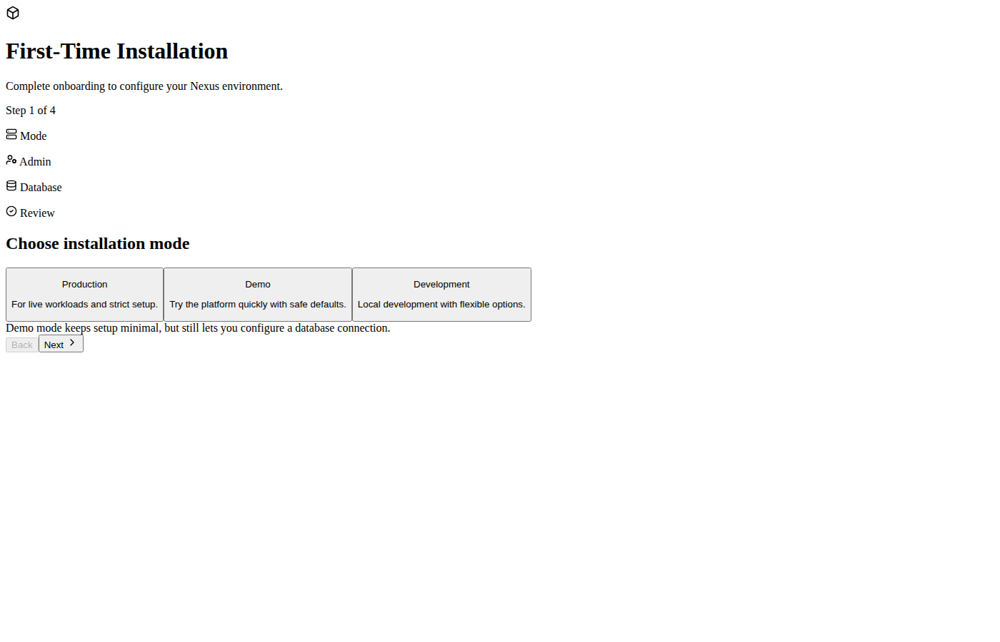
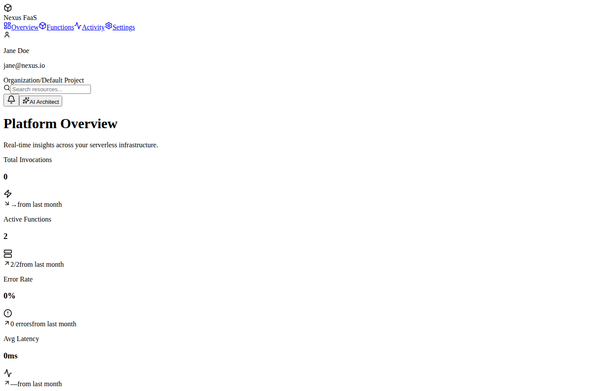
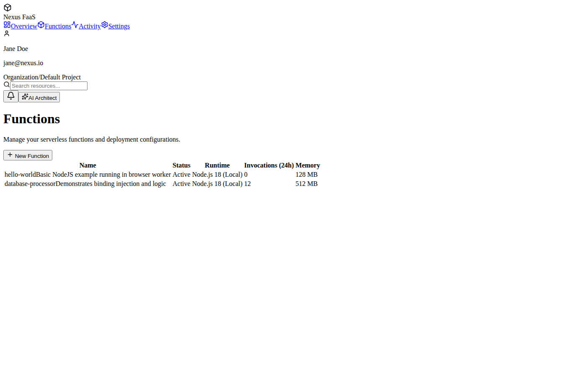

# Nexus FaaS Platform

A full-featured serverless Function-as-a-Service management console built with React, TypeScript, and AI assistance. Manage, deploy, and monitor serverless functions with a modern dark-themed UI.

## Features

- **Platform Dashboard** — Real-time metrics (invocations, error rate, latency, estimated cost) with area and bar charts
- **Function Management** — Browse and manage all serverless functions with status, runtime, and invocation data
- **Function Editor** — Multi-tab editor with Code, Configuration, Bindings, Metrics, and Test tabs
- **AI Architect** — Integrated Gemini-powered AI chat for writing code, debugging errors, and configuring infrastructure
- **First-time Onboarding** — Guided wizard to configure admin account, database, and installation mode

## Run Locally

**Prerequisites:** Node.js 18+

1. Install dependencies:
   ```bash
   npm install
   ```
2. Create a `.env.local` file in the project root and set your Gemini API key:
   ```env
   GEMINI_API_KEY=your-gemini-api-key
   ```
3. Run the app:
   ```bash
   npm run dev
   ```

## First-time Installation Wizard

On first launch, an onboarding wizard walks administrators through platform setup:

- **Production mode** — full setup for admin account and database configuration
- **Demo mode** — quick-start with safe defaults and optional DB configuration
- **Development mode** — local/dev setup with flexible admin and database options

### Database setup options

| Engine | Details |
|--------|---------|
| SQLite | Local file path (default: `./data/nexus.db`) |
| MySQL | Host, port, database name, username |
| PostgreSQL | Host, port, database name, username |

## Platform Overview

### Dashboard

The main dashboard shows real-time infrastructure insights:

- **Total Invocations** — cumulative call count across all functions
- **Active Functions** — count of functions in `Active` state vs. total
- **Error Rate** — percentage of `ERROR`-level log entries
- **Avg Latency** — mean execution time derived from `REPORT` logs
- **Estimated Monthly Cost** — calculated from invocation count and GB-seconds
- **Invocation Volume chart** — 24-hour area chart
- **Latency p95 chart** — 24-hour bar chart

### Function List

Tabular view of all deployed functions showing name, description, status badge, runtime, 24-hour invocations, and memory allocation. Click any row to open the editor.

### Function Editor

Five-tab editor for a selected function:

| Tab | Contents |
|-----|---------|
| **Code** | Source code editor with AI code generation and Deploy button |
| **Configuration** | HTTP trigger (path/method), CRON schedule, environment variables, memory, and timeout |
| **Bindings** | Storage and database binding configuration with live operation log |
| **Metrics** | Per-function invocation volume, error rate, and latency charts |
| **Test** | Send mock JSON payloads with optional auth header and view invocation results |

### AI Architect

Click **AI Architect** in the top bar to open a side-panel chat powered by Gemini. Ask it to write function code, explain errors, or suggest infrastructure configurations.

## Screenshots

### Onboarding wizard (first-time setup)



### Platform Dashboard



### Functions List



### Function Editor


## Tech Stack

- **React 19** + **TypeScript**
- **Vite** — build tooling and dev server
- **Tailwind CSS** — utility-first styling
- **Recharts** — interactive charts
- **React Router v7** — client-side routing
- **Lucide React** — icon library
- **Google Gemini** (`@google/genai`) — AI chat and code generation

## Production Build & Deployment

To create a production-optimised bundle:

```bash
npm run build
```

The output is written to the `dist/` folder and can be served by any static-file host.

### Deploying to a static host

| Platform | One-liner |
|----------|-----------|
| **Netlify** | `netlify deploy --dir dist --prod` |
| **Vercel** | `vercel --prod` (set `Output Directory` to `dist`) |
| **GitHub Pages** | push `dist/` contents to the `gh-pages` branch |
| **Nginx / Apache** | copy `dist/` to your web root and configure rewrites to `index.html` for SPA routing |

> **Note:** Because the app uses client-side (hash-based) routing, no special server-side rewrite rules are required when using `HashRouter`.
